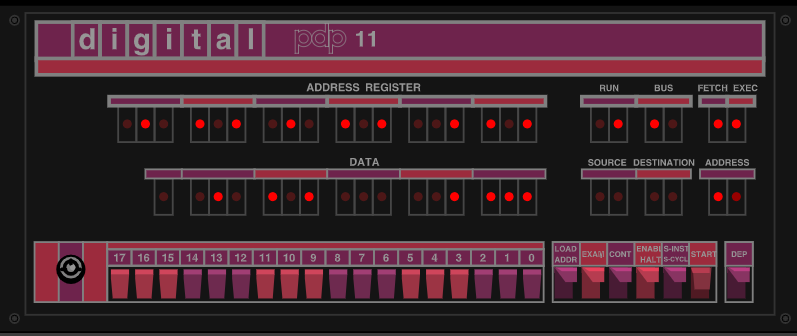
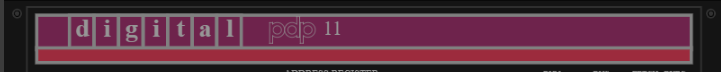
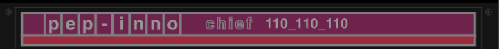

# PDP11_front_face
This is an experiment with P5.js    
   
# Size 
The PDP11 panel is designed in a 440x180 pixels.    
The whole is scalable : for a smaller or larger panel use the p5 *scale* instruction.  

## Relative context
PDP.draw() is bordered by a pus()/pop() couple. This insure no global setup are changed after draw.   
PDP.draw() starts with current position as its left-high angle interpreted as (0,0). 
 
## Leds  use HSB color mode.
The pdp use inside some HSB colors,more convenient to draw leds with variations of saturation and brightness.    
A pool of leds is set up as a collection of *SimpleLed* objects.   
The two bar of leds , address & data, are radomly filled in.     
A *randomizeLeds* method change them with a tempo based on framecount.   

## P2D or WEBGL 
The front panel is flat so 2D is enough.    
 All the drawings are done with z = 0.   
### minor variants for WEBGL
If you are in a WEBGL canvas ( automatic detection) :   
-  the PDP add a box behind the front panel.
- some z adjustments are added to draw the 'pdp' acronym, to have rectangles over circles. 
- as text are not drawn in the same manner, some stroke or textSize are adapted.    

note : If you rotate this box and panel in 3D, text will not allways be correct, especially with x rotation. Make tests.  

 

# Running the example 
## Simple web server   
You need to load examples from an http server to avoid *CORS* problem while loading font.    
For my own tests, i use *nodejs* with the package *http-server*.   
I run it without caching option for quick prototyping : 
``` 
http-server -c-1
```   
### You have no web server : workaround 
PDP loads a special font, Helvetica , close to the original font used by Digital Equipment in old time.   
This is the only point that can lock you with an infinite 'loading' on the screen.   
To test directly (without web server) you can comment the first line of PDP11 constructor :  
```javascript
        this.helvetica = loadFont('./assets/AG_Helvetica_Bold.ttf');
```   
Text will fall on some default font available in navigator. Not so bad: 
   

# Why that ? 
PDP-11 was my first computer used in intensive care units for monitoring premature babies in 1978.    
The initial boot was loaded in binary by hand using the switches you can see.   
Then a perforated paper tape was read to load the real operating system, RT11.   
Coding a fake old PDP in modern P5.js is rather fun .     
   

   

---   
### Revision 0
One can change some of the default values of PDP ( but no more a PDP...) :   

``` javascript
function preload() {
    PDP_11 = new PDP();
    /* to play, you can change parts of the name of computer. (But logo will be written)*/
    PDP_11.name = 'pep-inno';
    PDP_11.serialNb = "110_110_110" ; 
    PDP_11.pdpLogo = "chief";
}
```   

   


