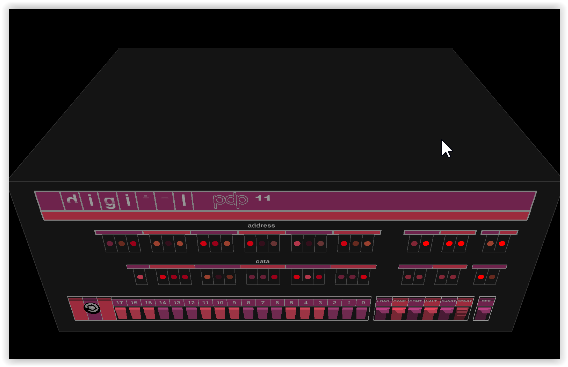

# PDP11_front_face
This is a first experiment with P5.js in WEBGL mode :   
   
  
## Simple web server to avoid *CORS* problem.  
To see labels, you must run it from a web server:   
For my own, i use *nodejs* with the package *http-server*.   
I run it without caching option for development : 
``` 
http-server -c-1
```   
### Workaround without web server
To test directly (without web server) you can comment the first line of PDP11 constructor :
```javascript
        // comment this line if no web server to deliver font 
        this.helvetica = loadFont('./assets/AG_Helvetica_Bold.ttf');
```    
but you will not see any label 
# size 
The PDP11 panel is designed in a 440x180 pixels.    
The whole is scalable without changing these sizes (as some positions are absolute in code).   
To obtain a smaller or larger panel use the p5 *scale* instruction.   
The following adjust PDP11 to the current width canvas :   
```javascript
function draw() {
    background(0);
    // calculate a scale to fill full width of canvas with PDP
    var aScale = width/PDP_11.width;
    //  // adjust to draw PDP at scale on the lower part of canvas
    translate(-width/2,height/2 - PDP_11.height*aScale,0);
    scale(aScale);
    PDP_11.draw();
}
```
# Some comments 
## Leds
I use HSB colors, more convenient to draw leds with variations.    
A pool of leds is set up as a collection of *SimpleLed* objects.   
When leds'bars are drawn, a random choice is done. This simulates changing lights. 
To test some javascript code, the function to draw leds take two parameters :   
 - a number of leds to be drawn 
 - either a named led or *nothing* to leave a random choice in preset leds'array.   
```javascript
     drawLeds(nb, someLed) {
        var aLed = someLed;
        var randomChoice = (typeof (aLed) == 'undefined');
```
## 3D 
Quite all the drawings are done with z = 0 .   
( Due to standard camera position in WEBGL, some minor adjustments where made to draw the 'pdp' acronym. To be sure to have lines over circles, some z pixels are added to some lines. )    
The front panel is associated with a back box with an arbitrary depth of 300 px, just to see some 3D and visualize the camera position. 

You can rotate this box and panel in 3D, but, as you can see below, text will not allways be correct, especially with x rotation. Make tests.  
  

# The story
PDP-11 was my first computer ( used in intensive care units for monitoring premature babies in 1978).  
The initial boot was loaded in binary by hand using the switches you can see.   
Then a perforated paper tape was read to load the real operating system, RT11.   

